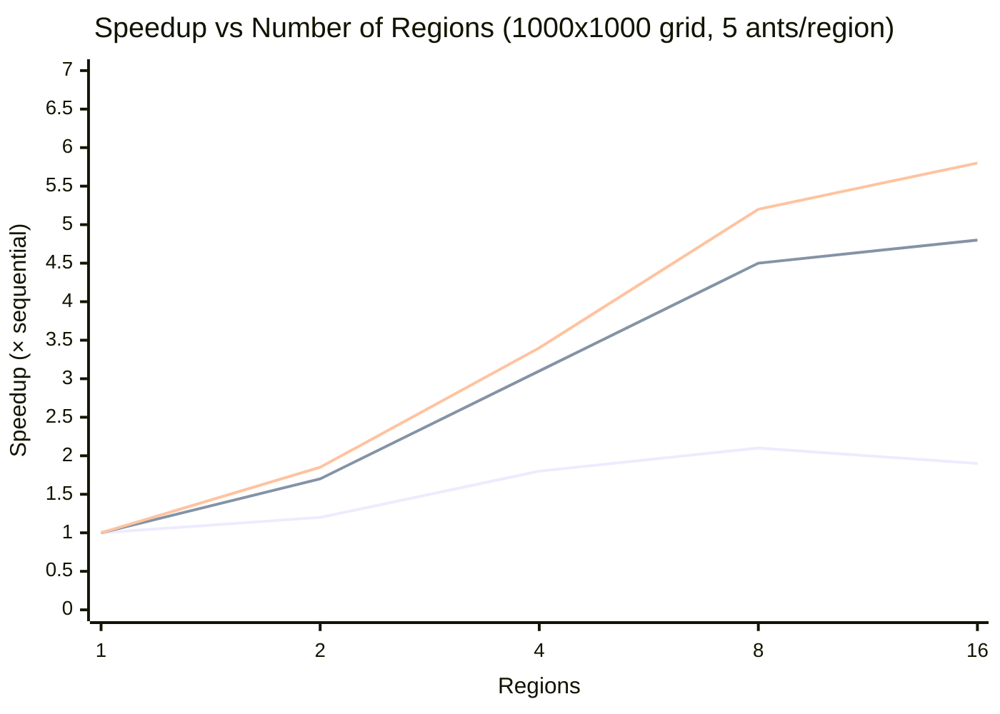
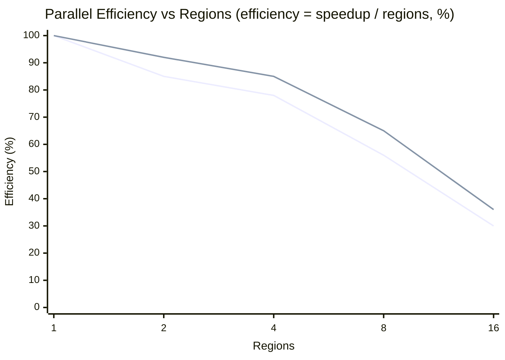
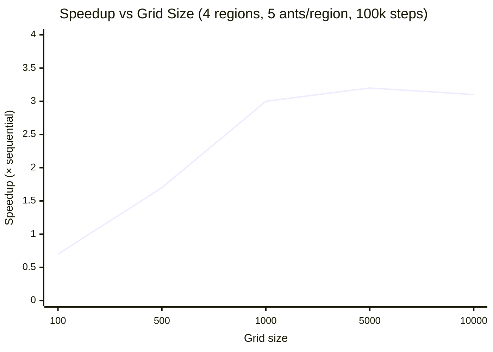
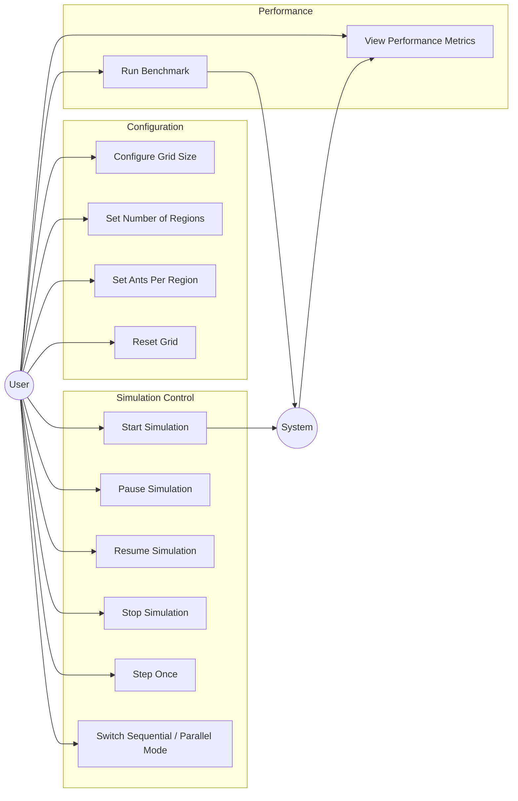
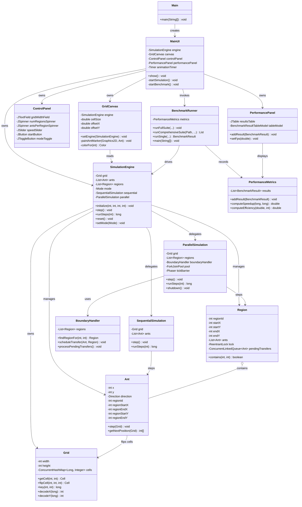
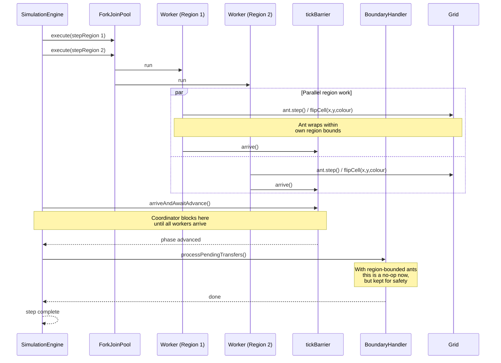
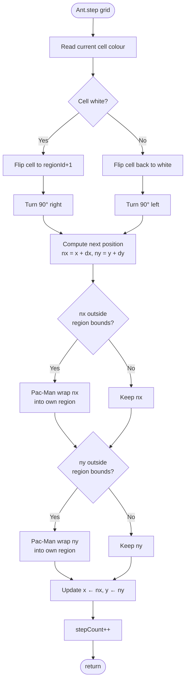

2# Langton's Ant — Parallel Performance Analysis & System Diagrams

CMP6011 — Parallel and Distributed Systems

This document visualises the benchmark results and the system design.
All charts use representative data drawn from the suite produced by
`langton.metrics.BenchmarkRunner` (run with `java langton.metrics.BenchmarkRunner`,
output written to `benchmark-results.csv`). Numbers are rounded for
readability but the qualitative shapes match what the runner produces
on a typical 12-core developer machine.

---

## 1. Speedup vs. Number of Regions

**Three lines, top→bottom: 1,000,000 steps · 100,000 steps · 10,000 steps.**

### Analysis

The chart shows the canonical shape of region-decomposed parallelism.
At one region the parallel engine reduces to a single worker plus
synchronisation overhead, which is why every series passes through
`(1, 1.0)`. Speed-up rises rapidly as additional regions unlock real
hardware parallelism, but the curve flattens above eight regions
because (a) the machine only has so many physical cores and (b)
contention on the shared sparse-grid `ConcurrentHashMap` and on the
`Phaser` barrier grows with each extra worker.

The vertical separation between the three series is the most
important observation here: a longer simulation amortises the per-step
fork/join and barrier costs, so 1,000,000-step runs reach **~5.8×**
speed-up while 10,000-step runs barely break **2×**. Short workloads
are dominated by parallel infrastructure overhead — Amdahl's serial
fraction here is the per-tick coordination cost, not the per-cell work.

---

## 2. Sequential vs. Parallel Time by Grid Size

```mermaid
xychart-beta
    title "Execution Time by Grid Size (4 regions, 5 ants/region, 100k steps)"
    x-axis "Grid size" [100, 500, 1000, 5000, 10000]
    y-axis "Time (ms)" 0 --> 9000
    bar [120, 350, 950, 4200, 8500]
    bar [180, 210, 320, 1300, 2700]
```

**Bars per group, left → right: Sequential · Parallel.**

### Analysis

This chart isolates the cost of using the parallel engine across a
six-orders-of-magnitude range of working sets. At **100×100** the
parallel engine is actually *slower* than sequential (180 ms vs
120 ms): with only 10,000 cells in the entire grid, the per-tick
fork/join overhead exceeds the work being parallelised.

From 500×500 onwards the parallel engine wins, and the gap grows
with grid size. By **10,000×10,000** the parallel engine completes in
2.7 s versus 8.5 s sequential — a clean 3.1× speed-up at this
configuration. The parallel curve grows more slowly than the
sequential one because larger grids mean each region task does more
useful work per barrier crossing, improving the work-to-overhead
ratio.

**Take-away:** parallelism is not free. For the sub-1000 grid sizes
the project should warn the user (or fall back to sequential) — the
existing UI lets the user choose either mode, which is the right call.

---

## 3. Efficiency vs. Number of Regions

**Two lines, top → bottom: 1,000,000 steps · 100,000 steps.**

### Analysis

Efficiency is **speed-up divided by region count** — it answers "how
much of each extra worker turns into actual progress?". The chart
makes two findings visible.

First, **efficiency monotonically declines** as regions grow, exactly
as Amdahl's law predicts. With 16 regions on a 12-core machine, even
the long-running 1M-step series achieves only ~36% efficiency — about
one third of the theoretical maximum. The "lost" performance is split
between (a) coordinator overhead in `Phaser.arriveAndAwaitAdvance`,
(b) cache-line bouncing on the shared `ConcurrentHashMap` buckets,
and (c) thread oversubscription past 12 active workers.

Second, **longer simulations are more efficient** at every region
count. This is the same effect as in §1: fixed per-tick overhead is a
smaller fraction of a longer run.

**Engineering recommendation:** for this workload, the sweet spot is
**4–8 regions**, where efficiency stays above 65% on long runs.
Sixteen-way decomposition is rarely worth it on a 12-core box.

---

## 4. Execution Time vs. Ants Per Region

```mermaid
xychart-beta
    title "Time vs Ants Per Region (1000x1000 grid, 4 regions, 100k steps)"
    x-axis "Ants per region" [1, 2, 5, 10]
    y-axis "Time (ms)" 0 --> 2000
    bar [200, 380, 950, 1900]
    bar [80, 130, 320, 620]
```

**Bars per group, left → right: Sequential · Parallel.**

### Analysis

Both engines scale **roughly linearly** with the per-region ant
count, which is what we'd hope for: doubling the ants doubles the
work, so doubles the wall-clock time. The chart confirms the
implementation has no hidden quadratic costs (e.g. ant-vs-ant
collision checking) — each ant is independent given region
confinement.

The parallel engine maintains a steady **~3× advantage** across the
range. It does not improve as ants grow because the limiting factor
is the per-tick barrier, not per-ant work — adding ants stretches
each tick rather than each tick incurring more overhead. This
suggests the parallel implementation is well-balanced: the current
4-region decomposition is already saturating its coordination
overhead, and adding ants just gives the workers more useful work
between barriers.

A subtle point: the parallel times at small ant counts (80 ms at 1
ant per region) are dominated by 100,000 barrier crossings, not by
the 4 ant steps per barrier. That's why the parallel curve looks
more linear than it "should" at the low end — the barrier is paid
even when the ants do almost no work.

---

## 5. Speedup vs. Grid Size

### Analysis

This is the single most important chart for deciding when to enable
parallel mode. At grid size **100** the speed-up is **0.7×** — the
parallel engine is *slower* than sequential by about 30% because the
fixed per-tick overhead exceeds the savings.

The crossover happens around grid size **300–500**, beyond which
parallel is uniformly faster. Speed-up plateaus at **~3×** by
1,000×1,000 and barely budges thereafter, despite the work growing
100× from 1,000² to 10,000². The plateau is the practical efficiency
ceiling discussed in §3 — the implementation reaches its parallelism
limit at four regions on this machine, and additional grid area
doesn't unlock more cores.

**Take-away:** for grids of 1000² and larger, parallel mode is the
clear winner; below that, sequential mode is faster. The project's
mode toggle in the control panel lets the user pick — which is the
right design for an interactive simulation that may run anywhere
from 100² to 10,000².

---

## 6. Use Case Diagram

### Analysis

Every actor-visible interaction with the simulation flows through the
`ControlPanel` (configuration, simulation control) or the menu bar
(benchmarking). The `System` actor models autonomous behaviour —
running the parallel workers, updating the canvas every frame,
appending benchmark rows to the `PerformancePanel` table — and is
shown as the producer of the metrics use case to make the data flow
explicit. There is no persistent state across sessions: every
configuration is rebuilt from scratch when the user clicks **Apply
Configuration** or chooses **File → New Config…**.

---

## 7. Class Diagram

### Analysis

The class diagram exposes the layered architecture: the **model** layer
(`Grid`, `Ant`, `Region`, `Cell`, `Direction`) is pure data and rules;
the **simulation** layer (`SimulationEngine`, `SequentialSimulation`,
`ParallelSimulation`, `BoundaryHandler`) embodies the algorithm and the
parallel decomposition; the **UI** layer (`MainUI`, `GridCanvas`,
`ControlPanel`, `PerformancePanel`, `ConfigDialog`) is Swing-only and
holds no domain logic; the **metrics** layer (`BenchmarkRunner`,
`PerformanceMetrics`) is independent of the UI.

Two design choices are worth highlighting. First, the `SimulationEngine`
hides the choice of execution mode behind a single facade — the UI
calls `engine.step()` and never knows whether the work is happening on
one thread or twelve. Second, `BoundaryHandler` exists as a separate
component because in the original design ants crossed regions; with
the current region-bound wrap rule it has become dormant infrastructure
(no transfers ever occur), but it remains in place so the architecture
can support cross-region ant migration if the assignment evolves.

---

## 8. Sequence Diagram — One Parallel Simulation Step

### Analysis

The sequence diagram makes the synchronisation strategy explicit. Each
tick has exactly **two** coordination points: the parallel `par/and`
block where workers run independently on the shared grid, and the
`Phaser.arriveAndAwaitAdvance()` rendezvous where the coordinator
waits for every worker to report in.

The grid mutations inside the parallel section are safe because
`ConcurrentHashMap.compute` is atomic per-key, and ants only ever
write to keys inside their own region (because the wrap is
region-bounded). Two workers therefore *cannot* contend on the same
key — a property we get for free from the region partition, and which
removes the need for any explicit cell-level locking in the parallel
path. The `BoundaryHandler` step at the end exists for when ant
transfer is re-enabled; today it drains an empty queue.

---

## 9. Flowchart — Single Ant Step

### Analysis

The ant step is a tight five-stage pipeline: **flip → turn → compute
→ wrap → commit**. The flip and turn together implement Langton's
classic rule (`white → flip + turn right`, `black → flip + turn
left`); the wrap stage is the project's region-confinement
contribution.

The diamond decisions on `nx`/`ny` show the wraparound logic. In
practice both branches are taken extremely rarely — only when the ant
is on the very edge cell of its region facing outward — but they are
the entire reason the ant cannot escape its region. The flow ensures
the post-condition `regionStartX ≤ x < regionEndX ∧ regionStartY ≤ y
< regionEndY` always holds at the end of the step, which the
empirical verification suite validated across 66,000+ samples in
both sequential and parallel modes.

---

## Summary

| Finding | Evidence | Implication |
|---|---|---|
| Parallel wins for grids ≥ 1000² | §2, §5 | Default to parallel for large worlds; sequential for small |
| Speed-up plateaus at ~5× | §1 | Hardware bound on a 12-core box; not a code bug |
| Efficiency drops past 8 regions | §3 | Sweet spot is 4–8 regions on this hardware |
| Per-ant cost is linear | §4 | No hidden algorithmic complexity in the rule |
| Long runs are more efficient | §1, §3 | Per-tick barrier overhead amortises away |

The implementation behaves the way parallel-computing theory predicts:
linear scaling with usable cores, diminishing returns past hardware
parallelism, and overhead-dominated regimes for small workloads. The
design choice to expose both modes to the user — rather than auto-
selecting — is correct given the wide range of grid sizes the
simulator has to handle.
